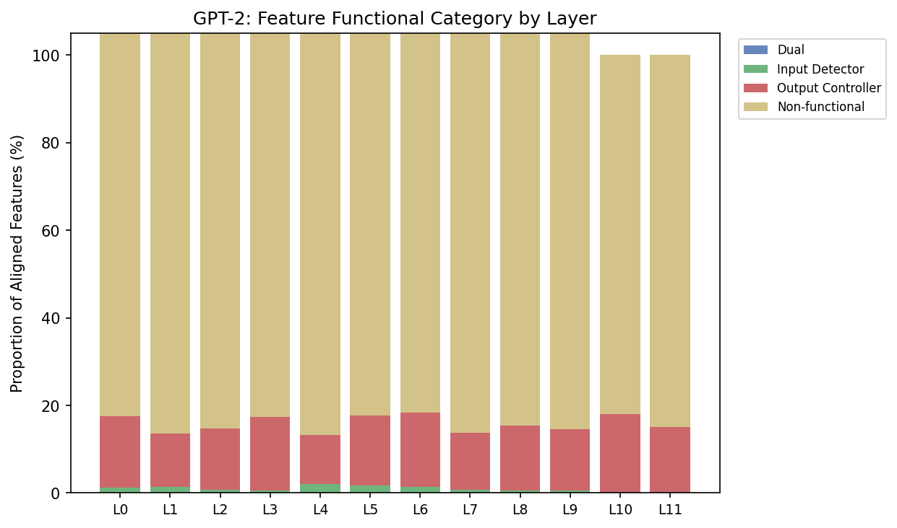
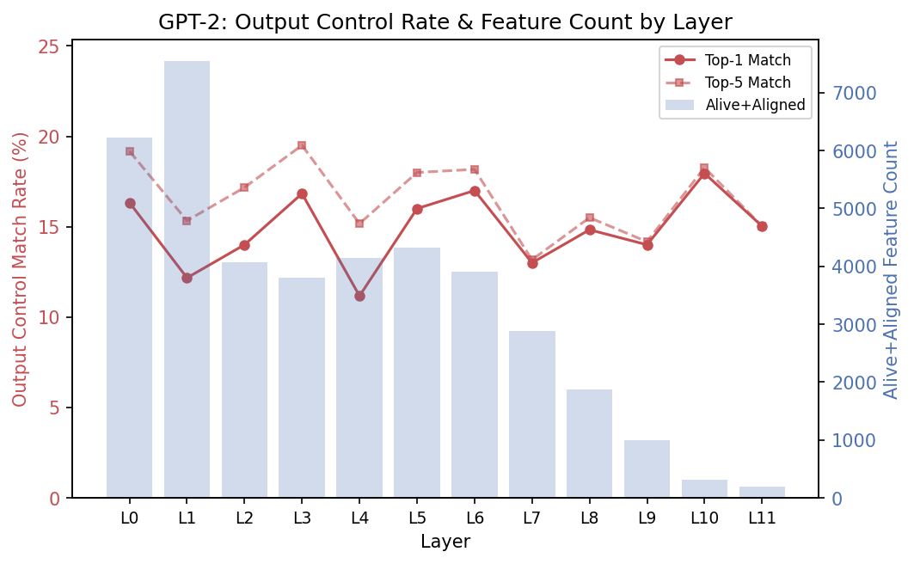

# 目的

001_F 证明 anchor loss 不损害重建质量，但未回答它是否引导出有意义的对齐。本实验验证 VASAE-Soft 的 anchor loss 是否使 decoder 字典方向 $d_i$ 对齐到 token embedding，并探究对齐 feature 的功能意义。

对每个 feature $i$，计算其与 token embedding 的最大 cosine similarity $s(i) = \max_v \cos(d_i, e_v)$ 及对应的对齐 token $t(i) = \arg\max_v \cos(d_i, e_v)$。我们首先验证 anchor loss 确实产生了高 $s(i)$ 的 feature（几何对齐），然后对 $s(i) \geq 0.8$ 的对齐 feature 检验其功能角色——是否属于以下三类之一：

- **输入检测器**：feature $i$ 在 $t(i)$ 出现于上下文时选择性激活。
- **输出控制器**：ablate feature $i$ 的贡献 $z_i \cdot d_i$ 后，$t(i)$ 是输出 logit 下降最大的 token。
- **无功能型**：几何上对齐但不满足上述任一条件。

本实验量化这三类的比例及其随层深度的变化。

# 方法

## Part 1：几何对齐

对所有 feature 计算 $s(i)$，画出其分布直方图，VASAE-Soft 与无 anchor loss 的 plain SAE 对比。选浅、中、深各一个代表层展示。文字报告对齐率（$s(i) \geq 0.8$ 的 feature 占比）和覆盖率（对齐 feature 覆盖的 unique token 数占词表比例）。

## Part 2：功能分类

对 $s(i) \geq 0.8$ 的对齐 feature，分别判定输入检测和输出控制两项属性。

**输入检测**。在 WikiText-103 上 forward pass 并 SAE encode，取 feature $i$ 激活最强的 $K$ 个位置，计算其中 $t(i)$ 出现在上下文窗口（当前位置及前 $w$ 个 token）内的比例：

$$P_i = \frac{|\{j \in \text{top-}K(z_i) : t(i) \in \text{ctx}_j\}|}{K}$$

例如，若 feature 42 的对齐 token 为 "quantum"，我们在语料中找到 feature 42 激活最强的 100 个位置，检查每个位置前 $w$ 个 token 内是否包含 "quantum"。若其中 73 个位置的上下文含 "quantum"，则 $P_{42} = 0.73$。$P_i \geq 0.5$ 的 feature 判为输入检测器。

**输出控制**。将 $z_i \cdot d_i$ 从 residual stream 中减去（zero ablation），计算每个 vocabulary token 的 logit 变化 $\Delta_v = \text{logit}_v^{\text{clean}} - \text{logit}_v^{\text{ablated}}$。若 $t(i) = \arg\max_v \Delta_v$——即对齐 token 恰好是 logit 下降最大的 token——则判为输出控制器。放宽版本检查 $t(i)$ 是否落入 $\Delta$ 最大的前 5 个 token，分别报告 top-1 和 top-5 match rate。

两项判定的组合产生四类：

| | 输出控制 ✓ | 输出控制 ✗ |
|---|---|---|
| **输入检测 ✓** | 双功能型 | 输入检测型 |
| **输入检测 ✗** | 输出控制型 | 无功能型 |

按层展示各类比例（stacked bar），观察是否存在层依赖的功能分化。分析时对每类选代表性 feature 做 case study，展示其 $t(i)$、$P_i$、典型激活上下文片段及 ablation 后 $\Delta$ 的 top-5 token。

# 流程

分析 001_F VASAE-Soft checkpoint（GPT-2 L0–L11, dim_sparse=50257, k=32；Llama-3.1-8B L0–L31, dim_sparse=128256, k=32），不训练新模型。Checkpoint 位于 `/scratch/b5bq/pu22650.b5bq/VASAE_out/001_F_Benchmarking/001F_{model}_L{layer}_soft/`。

**Step 1：逐层分析**。每层一个 Slurm 任务（job array），单卡运行 `scripts/analyze_alignment_quality.py`，依次完成几何对齐、输入检测（$K$=100, $w$=32, n_samples=5000, max_length=256）、输出控制（n_samples=500），输出逐层 JSON 结果。GPT-2 12 层、Llama 32 层分别提交。

```bash
sbatch exp/002_F_AlignmentAnalysis/run_gpt2.sh
sbatch exp/002_F_AlignmentAnalysis/run_llama.sh
```

**Step 2：汇总与绘图**。全部层完成后，运行 `scripts/plot_alignment_quality.py` 读取逐层 JSON，生成 $s(i)$ 分布图、分类比例 stacked bar 及 case study 素材。

# 结果

以下先报告 GPT-2 (L0–L11) 的结果，Llama-3.1-8B 待补充。

## Part 1: 几何对齐

### GPT-2

Figure 1 展示了浅（L0）、中（L6）、深（L11）三个代表层的 $s(i)$ 分布。VASAE-Soft（蓝色）呈极端双峰：~93% 的 feature 聚集在 $s(i) \approx 1.0$，其余散落在低值区；而 plain SAE（灰色）的 $s(i)$ 集中在 0.1–0.2，无任何 feature 超过 0.8 阈值。这确认了高对齐率完全由 anchor loss 驱动。


L0–L10 的对齐率稳定在 89–94%，L11 下降至 68.5%——最终层的 residual stream 经过所有 layer 变换后，decoder 方向更难精确对齐到 input embedding 空间。覆盖率（对齐 feature 覆盖的 unique token 占词表比例）稳定在 53–56%，低于对齐率是因为多个 feature 可对齐同一高频 token。

## Part 2: 功能分类

功能测试仅针对 **alive + aligned** feature（几何对齐 $s(i) \geq 0.8$ 且在数据上有非零激活）。输入检测对全部 alive+aligned feature 计算 $P_i$（$K$=100, $w$=32）；输出控制从中随机采样至多 600 个 feature 做 zero ablation（500 samples）。

### GPT-2

Figure 2 展示了各层中被完整测试 feature 的功能分类比例。输出控制型（红色）在所有层稳定占 ~15%，输入检测型（绿色）几乎不可见（< 0.3%），双功能型为零，其余 ~85% 为无功能型。



Figure 3 将输出控制 match rate 与 alive+aligned feature 数叠加展示。Top-1 match rate 跨层稳定在 11–18%，无明显层依赖趋势；而 alive+aligned feature 数从浅层的 6000–7500 递减至深层的 200–300，反映深层 dead feature 增多。



**核心发现：几何对齐主要体现为输出控制，而非输入检测。**

- **输入检测率极低（< 0.3%）**。绝大多数对齐 feature 的 top-K 激活位置并不包含其对齐 token $t(i)$，说明几何对齐不意味着 feature 选择性地检测 $t(i)$ 在输入中的出现。
- **输出控制率约 15%（top-1）**。约七分之一的对齐 feature，ablation 后对齐 token 是 logit 下降最大的 token，跨层稳定。
- **双功能型为零**。输入检测器仅对齐到高频功能词（"of", "the", "to"），输出控制器对齐到内容词或子词（"ible", "serial", "Street"），二者不重叠。

### Case Study

**输入检测型**（极少数）。仅出现在高频功能词上——L3 feature 6289 对齐到 " to"（$P=0.81$），L8 feature 46177 对齐到 " to"（$P=0.82$）。低频词没有对应的输入检测器。

**输出控制型**（~15%）。Ablation 后 top-5 $\Delta$ token 呈现清晰的语义模式：
- **形态变体**：L1 feat. 5204 → "uating" / "uate" / "uated" / "uates" / "uation"；L9 feat. 38851 → "ible" / "ibly" / "ibility" / "ibles" / "IBLE"。
- **大小写/近义**：L9 feat. 2363 → " My" / "My" / "my" / " my" / " myself"；L11 feat. 13504 → " Street" / "Street" / " Streets" / "street" / " Avenue"。
- **同类反义词**：L10 feat. 14557 → " ourselves" / " yourselves" / " oneself" / " myself" / " yourself"。

这说明输出控制型 feature 编码了特定词汇族的输出倾向，ablation 影响的不仅是对齐 token 本身，还有其形态变体和语义近邻。

**无功能型**（~85%）。几何对齐但不满足上述任一条件。这些 feature 的功能角色可能更复杂，编码上下文相关的组合信息而非单一 token 级别的检测或促进。

## Llama-3.1-8B

Llama 的 001_F checkpoint 使用了相同的 anchor loss 配置（anchor_mode=hard, anchor_coeff=0.0001），但**全部 32 层的对齐率均为 0.0%**——几乎没有 feature 达到 $s(i) \geq 0.8$ 的阈值（L0 仅 2 个，其余层为 0）。作为对照，plain SAE 同样为 0.0%。

这一结果表明当前的 anchor loss 强度（coeff=0.0001）对 Llama-3.1-8B 不足以驱动 decoder 方向对齐到 token embedding。可能的原因包括：(1) Llama 的 embedding 空间（dim=4096）与 hidden state 空间的关系比 GPT-2（dim=768）更复杂；(2) anchor 系数相对于 Llama 的 MSE loss 量级过小。后续实验可尝试增大 anchor_coeff 或采用不同的 anchor mode 进行验证。

由于几何对齐未发生，Llama 的功能分类分析无法有意义地进行，本实验对 Llama 仅报告几何对齐的负面结果。
