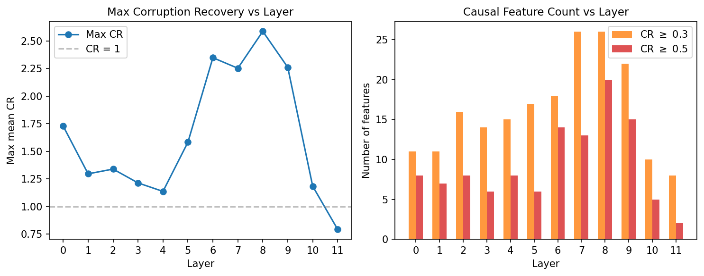
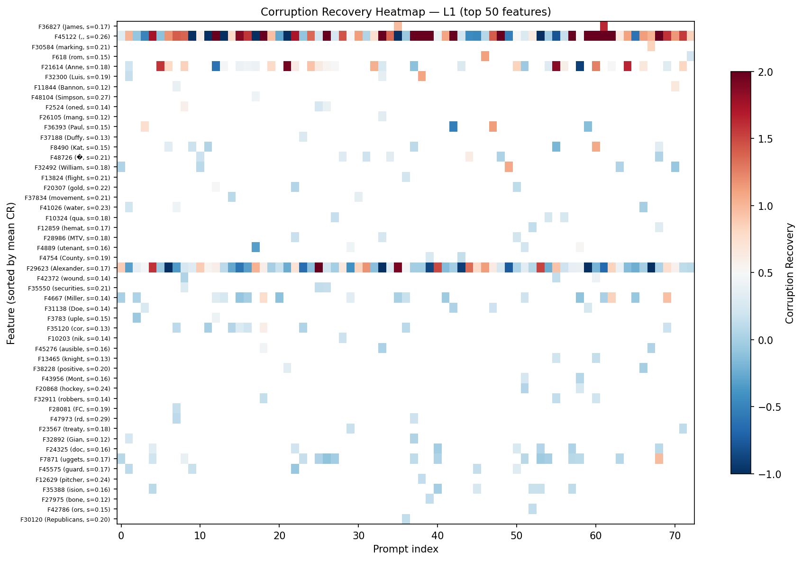
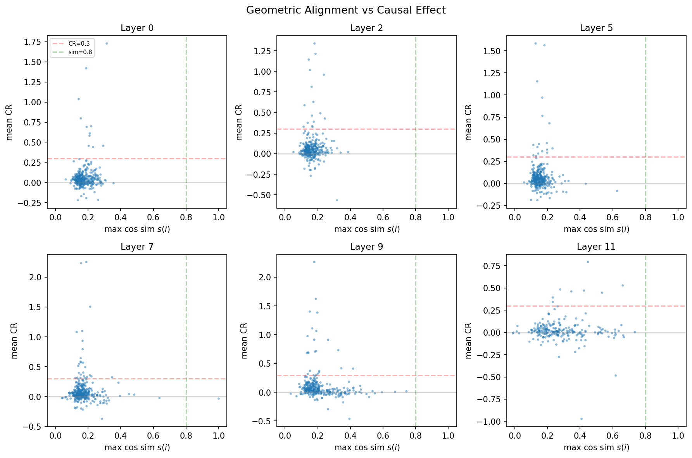
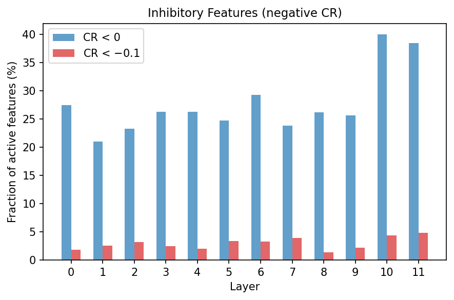

# 目的

002_F 证明 anchor loss 驱动了 decoder 方向到 token embedding 的几何对齐，并发现约 15% 的对齐 feature 充当输出控制器。但几何对齐和功能分类都是观测性的——未验证这些 feature 是否承载因果性的任务信息。本实验通过 IOI（Indirect Object Identification）任务，逐一消融 VASAE 特征并观察其对任务决策的影响，回答两个问题：

1. VASAE 分解出的方向是否承载因果信息？
2. 因果 feature 与 002_F 中的几何对齐之间是什么关系？

# 方法

## 任务与度量

IOI 任务构造一对输入：clean text（模型应输出正确名字）与 corrupted text（扰动关键结构使模型倾向错误名字）。定义 logit difference $\Delta u = u_{\text{correct}} - u_{\text{wrong}}$，理想情况下 $\Delta u_{\text{clean}} > 0 > \Delta u_{\text{corr}}$。

对 clean 输入的前向计算进行干预：消融单个 VASAE 特征 $f$ 的贡献（zero ablation），得到 $\Delta u_{\text{intervened}}^{(f)}$。若消融导致 $\Delta u$ 下降并接近 $\Delta u_{\text{corr}}$，说明该特征承载了支持正确解析的因果信息。

## Corruption Recovery

为在特征间进行可比分析，定义归一化指标：

$$\text{CR}^{(f)} = \frac{\Delta u_{\text{recon}} - \Delta u_{\text{intervened}}^{(f)}}{\Delta u_{\text{clean}} - \Delta u_{\text{corr}}}$$

其中分子使用 SAE 完整重建的 $\Delta u_{\text{recon}}$（而非原始 $\Delta u_{\text{clean}}$）作为基线，以隔离单个特征消融的纯粹效应，避免 SAE 重建误差污染因果度量。分母为 clean 与 corrupted 的原始 gap，作为归一化标尺。CR $\approx 1$ 表示消融几乎完全复现了 corrupted 扰动；CR $\approx 0$ 表示无影响。

## Specificity

仅凭高 CR 不足以判定因果特异性——消融也可能导致全局性表示破坏。为区分精准的任务特异性效应与非特异性性能退化，定义：

$$\text{Specificity}^{(f)} = \frac{\text{CR}^{(f)}}{D_{\text{KL}}(P_{\text{recon}} \| P_{\text{intervened}}) + \epsilon}$$

其中 KL 散度衡量消融对整体输出分布的扰动程度（同样以 SAE 重建分布为参考）。高 CR + 低 KL → 高 Specificity，说明消融精准改变了 IOI 决策而几乎不扰动其他输出；高 CR + 高 KL → 低 Specificity，说明因果效应可能来自全局性破坏。

## 对齐 token 标注

由于使用 vocab-aligned SAE（dim_sparse = vocab_size = 50257），每个 feature $i$ 有对应的对齐 token $t(i) = \arg\max_v \cos(d_i, e_v)$ 及对齐程度 $s(i) = \max_v \cos(d_i, e_v)$。这使得我们可以直接检查因果 feature 的 token 语义，并与 002_F 的几何对齐分析对接。

# 实验流程

## 模型

使用 001_F 实验中训练的 VASAE-Soft（GPT-2，dim_sparse=50257, k=32, anchor_coeff=0.0001），覆盖全部 12 层（L0–L11）。Checkpoint 位于 `/scratch/b5bq/pu22650.b5bq/VASAE_out/001_F_Benchmarking/001F_gpt2_L{layer}_soft/`。

## 步骤

**Step 1：逐层特征消融扫描**。100 个 IOI prompt，过滤无效 prompt（$\Delta u_{\text{clean}} \leq 0$ 或 $|\Delta u_{\text{clean}} - \Delta u_{\text{corr}}| < 0.5$），剩余 73 个有效 prompt。每层 topk=32 个活跃特征，逐一消融并记录 CR、KL 及对齐 token 信息。12 层并行 Slurm array job。

```bash
sbatch exp/021_IOI/run_feature_sweep.sh
```

**Step 2：汇总与绘图**。

```bash
uv run python scripts/plot_ioi_feature_sweep.py \
    --input-dir /scratch/b5bq/pu22650.b5bq/VASAE_out/021_ioi_feature_sweep \
    --output-dir exp/021_IOI/figures
```

# 结果

## 稀疏因果结构

每层约 230–360 个 unique 活跃 feature（50257 个 feature 中大多数在 IOI prompt 上为 dead）。CR 分布呈典型的稀疏因果图景：各层 median CR 接近 0（0.01–0.05），**绝大多数特征的消融对 IOI 决策几乎无影响**；少数特征具有显著因果效应（CR $\geq 0.3$），每层 8–26 个。

## 层级分布（Figure 1）



Figure 1 左图展示各层 max mean CR，右图展示因果 feature 数量。与前层集中的预期不同，因果 feature 数量在 **L7–L9 达到峰值**（~26 个 CR $\geq 0.3$），前层（L0–L1）和末层（L10–L11）最少（8–11 个）。Max CR 同样在中后层更高（L8 达 2.59），提示 vocab-aligned SAE 在中后层捕获了更多的 IOI 相关计算。

## 因果 feature 的 token 语义

由于每个 feature 都有对齐 token $t(i)$，可以直接检查因果 feature 编码了什么 token 信息。一个突出的发现是：**约 50–60% 的因果 feature 的对齐 token 是人名或名字相关子词**——"James"、"Luis"、"Alexander"、"Anne"、"Paul" 等——尽管其 $s(i)$ 远低于 0.8 的几何对齐阈值。



Figure 2 展示 L1 top-50 feature 在 73 个 prompt 上的 CR 热力图。Y 轴标注每个 feature 的对齐 token 和 $s(i)$。可以观察到：

- **Feature 45122**（对齐 ","，$s$=0.26）在 73/73 个 prompt 上均激活，mean CR=0.85，是 L1 最稳定的因果 feature，可能编码了句法结构信息。
- **Feature 36827**（对齐 "James"，$s$=0.17）仅在 2 个 prompt 上激活但 CR=1.30，是典型的 prompt 特异性因果 feature。
- **Feature 29623**（对齐 "Alexander"，$s$=0.17）在 73 个 prompt 上广泛激活，mean CR 较低但一致为正。

## 几何对齐与因果效应的分离（Figure 3）



Figure 3 是本实验的核心发现。6 个代表层中，$s(i) \geq 0.8$ 的区域（绿色虚线右侧）几乎没有点——**IOI 任务中活跃的 feature 全部集中在低 $s(i)$ 区域**（$s < 0.4$）。002_F 发现 ~90% 的 feature 几何对齐（$s \geq 0.8$），但这些高对齐 feature 在 IOI prompt 上要么是 dead，要么 CR $\approx 0$。

这揭示了 vocab-aligned SAE 的功能分化：

- **几何对齐 feature（~90%，$s \geq 0.8$）**：承载单 token 级别的词汇信息（002_F 的输出控制器），在一般文本上活跃，但对需要组合推理的 IOI 任务不参与。
- **非对齐 feature（~10%，$s < 0.4$）**：编码上下文相关的组合信息，在 IOI 等任务中承载因果效应。尽管对齐 token 为名字相关词（如 "James"），低 $s(i)$ 说明这些 feature 方向与 token embedding 仅有微弱重叠，编码的是名字在特定句法位置出现时的组合表示。

深层（L11）的 $s(i)$ 分布向 0.4–0.7 区间右移，反映深层 feature 更多地参与词汇级输出准备，但仍未达到 0.8 阈值。

## 抑制性 feature（Figure 4）



约 21–39% 的活跃 feature 具有负 mean CR（消融后 IOI 表现反而提升），约 2–5% 的 feature 有 CR $< -0.1$ 的显著抑制效应。抑制性 feature 比例在 L10–L11 达到最高（~40%），提示深层存在更多的竞争性或调节性计算。

## 结论

1. **VASAE feature 承载可量化的因果信息**。少数 feature（每层 8–26 个）具有 CR $\geq 0.3$ 的显著因果效应，且 Specificity 普遍 > 30，说明因果效应具有任务特异性。
2. **几何对齐与因果参与正交**。002_F 中 $s(i) \geq 0.8$ 的高对齐 feature 在 IOI 中几乎不参与；承载 IOI 因果信息的是低对齐 feature（$s < 0.4$）。这说明 vocab-aligned SAE 自发分化出两类 feature：词汇级的对齐 feature 和任务级的组合 feature。
3. **因果 feature 偏向名字语义**。约半数因果 feature 的对齐 token 是人名或名字子词，尽管 $s(i)$ 很低。这提示 feature 编码了"名字在特定句法角色中出现"的组合信息，而非简单的 token 检测。
4. **因果效应在中后层最丰富**。与前层集中的直觉相反，CR $\geq 0.3$ 的 feature 数量在 L7–L9 达峰，可能反映 IOI 决策在中层整合而非仅在前层完成。

**局限性**。CR $> 1$ 的过冲现象在中后层更为常见，可能源于 SAE 重建误差的非线性放大或低频 feature 的小样本统计波动。完整的因果归因还需特征组合消融及随机方向对照实验。
