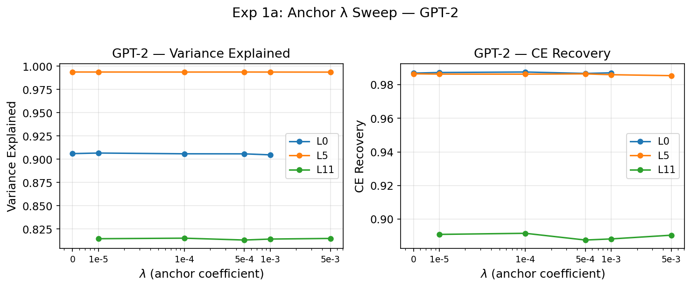
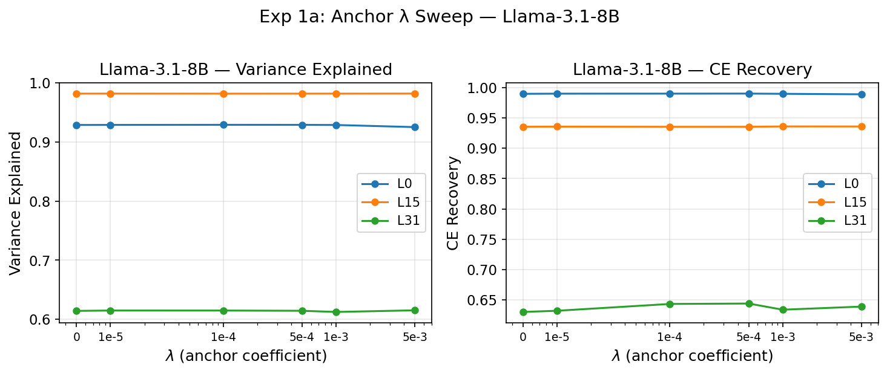
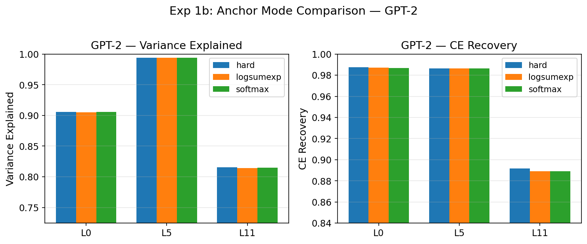
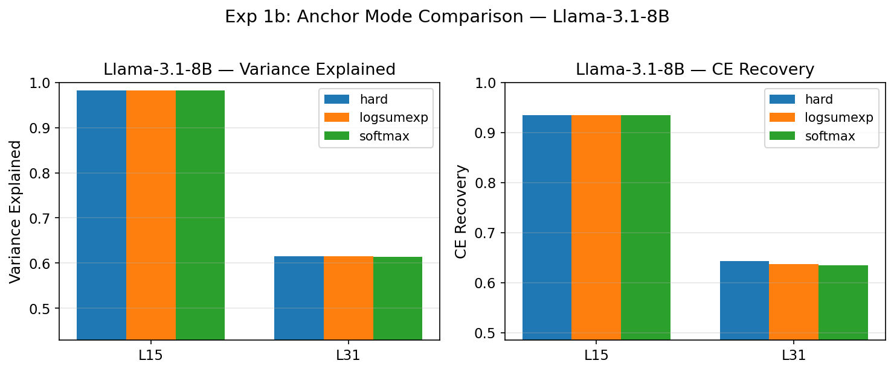
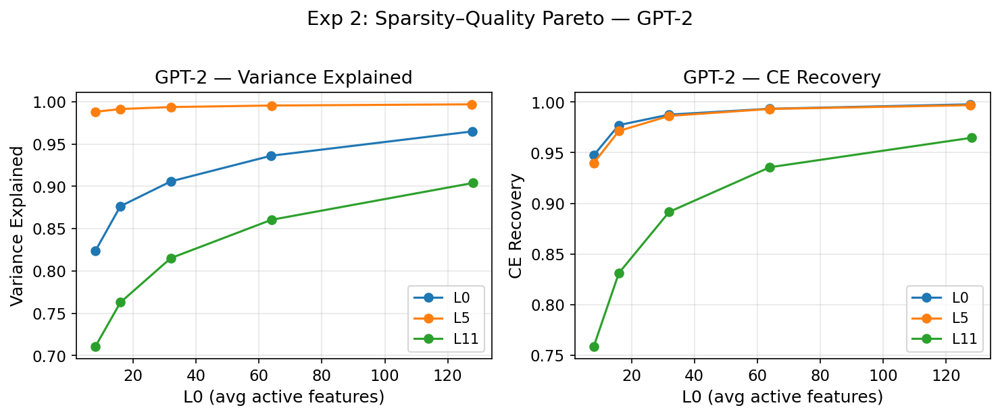
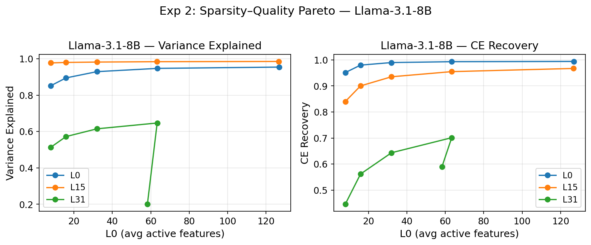
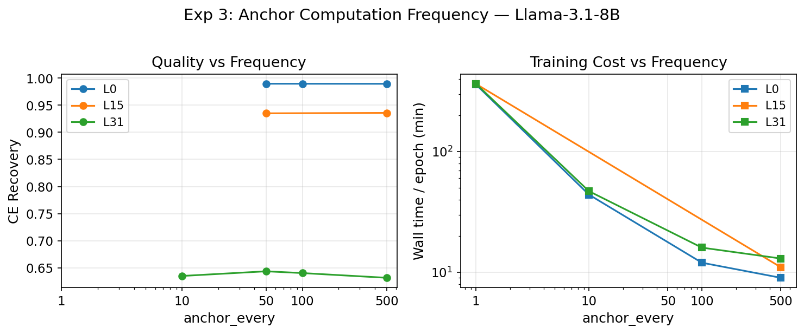

# 目的

对 VASAE-Soft 的关键设计选择进行消融，验证各超参数的敏感性和合理性。

# 方法

## 实验一：Anchor 配置消融（λ + mode）

### 1a. Anchor 系数 $\lambda$ 消融

预实验 Exp 007 在 GPT-2 L6/L11（tied decoder, k=8）上发现 $\lambda \le 3\text{e-}4$ 几乎是 free lunch。本实验在正式配置（untied decoder, k=32）下验证该结论，并扩展到 Llama。

固定 anchor mode = hard，$k = 32$，sweep：

$$\lambda \in \{0,\ 1\text{e-}5,\ 1\text{e-}4,\ 5\text{e-}4,\ 1\text{e-}3,\ 5\text{e-}3\}$$

代表层：GPT-2 L0/5/11，Llama L0/15/31。共 6λ × 6 层 = **36 tasks**。

### 1b. Anchor 模式消融

Exp 008 在 GPT-2 L6/L11 上证明 hard max 对齐效果远优于 logsumexp/softmax（L11: 87.6% vs 4.4% strong alignment），但未报告 VE 和 CE Recovery。本实验在正式配置下验证。

固定 $\lambda = 1\text{e-}4$（F001 所用值），$k = 32$，比较三种 mode：

| 模式 | 公式 |
| -- | -- |
| hard | $\max_j \cos(d_i, e_j)$ |
| logsumexp | $\text{logsumexp}(\text{top-}k_j \cos(d_i, e_j))$，$k=10$ |
| softmax | $\sum_j w_j \cdot \cos(d_i, e_j)$，$w = \text{softmax}(\text{top-}k \cos)$，$k=10$ |

其中 hard@λ=1e-4 已在 1a 中包含，新增 2 mode × 6 层 = **12 tasks**。


为考察 anchor regularizer 的具体聚合方式是否会影响对齐与重构，我们将特征与词表嵌入之间的余弦相似度记为 
sij=cos(fi,ej)，其中 fi 表示第 ii 个 decoder feature，ej表示第 j个 token embedding。anchor loss 的目标是提升每个 feature 与词表中某些语义邻近 token 的一致性，但不同的聚合方式会诱导不同的优化几何。

我们比较三种模式。hard 采用 winner-take-all 形式，直接取全词表上的最大相似度 maxjsij，因此每个 feature 只被其最近的 token 原型约束。这一形式是最尖锐的目标，优化信号集中，且与离散 token 对齐最直接。logsumexp 在 top-k 候选上对相似度做平滑上界聚合，相当于对局部邻域内多个高相似原型进行软化的“近似最大化”，比 hard 更平滑，但仍主要关注最接近的若干 token。softmax 则进一步将 top-
k 相似度归一化为一个分布，并对相似度作加权平均，等价于在局部邻域内计算期望相似度，因此比 logsumexp 更平滑、梯度更分散。

从优化视角看，hard 强调单一最近邻对齐，logsumexp 介于 hard 与 softmax 之间，而 softmax 提供最连续的近邻平均。我们在正式配置下比较这三种模式，旨在检验：anchor 正则究竟依赖于“尖锐的最近邻约束”，还是只要提供局部 token 邻域的弱对齐信号即可维持相同的重构质量。实现上，hard 不使用 top-k 截断；logsumexp 与 softmax 仅在 top-
k 候选集合上进行聚合，以避免对全词表进行不必要的平滑扩散。对应实现见 anchor.py:1 和 sae.py:230。

## 实验二：稀疏度帕累托曲线

固定 $\lambda = 1\text{e-}4$（hard mode），sweep $k$：

$$k \in \{8,\ 16,\ 32,\ 64,\ 128\}$$

由于 TopK 前有 ReLU（nonneg_latents），当正值不足 $k$ 个时实际 L0 < $k$。

其中 $k = 32$ 已在实验一中包含，新增 4k × 6 层 = **24 tasks**。

帕累托曲线以实际 L0 为横轴，VE / CE Recovery 为纵轴，展示 VASAE-Soft 的稀疏度-质量 trade-off，并观察不同 $k$ 下 dead feature rate 的变化。

## 实验三：Anchor 计算频率消融（仅 Llama）

Llama 词表 128256，每 batch 计算 anchor loss 代价过高（~8.5s/batch vs 正常 ~0.2s/batch）。001_F 中引入 `anchor_every` 每 N 步计算一次。需验证降低频率是否影响性能。

$$\texttt{anchor\_every} \in \{1,\ 10,\ 50,\ 100,\ 500\}$$

固定 $\lambda = 1\text{e-}4$，hard mode，$k = 32$。仅 Llama L0/15/31。

共 5 × 3 = **15 tasks**（其中部分与实验一重叠）。

## 执行顺序

1. **先跑实验三**：确认 anchor_every 的安全值，决定后续 Llama 实验使用的频率参数
2. **再并行跑实验一 + 二**

## 共享配置

与 F001_Benchmarking 的 VASAE-Soft 一致：

- dim_sparse = vocab_size（GPT-2: 50257, Llama: 128256）
- decoder: 独立可学习（untied）
- encoder: linear, TopK sparsity, nonneg latents
- Adam (lr=1e-3), max 20 epochs, early stopping (patience=3)
- WikiText-103, max_length=128
- GPT-2: float32, batch_size=32, train/eval/test = 50000/10000/5000
- Llama: bfloat16, batch_size=8, train/eval/test = 20000/2000/5000
- 与 F001_Benchmarking 配置完全一致，重叠配置点（Exp1a λ=1e-4, Exp3 anchor_every=50）直接复用 F001 结果

## 评估指标

- **VE**（Variance Explained）：归一化重构质量
- **CE Recovery**：功能性重构质量
- **Dead Feature Rate**：测试集上激活次数为 0 的 feature 占比（实验一、二报告）
- **L0**：每个输入的平均非零激活 feature 数，TopK + ReLU 下 L0 ≤ $k$（实验二报告）

# 流程

```bash
# 0. 实验三：Anchor 计算频率消融（先跑，确认 anchor_every 安全值）
sbatch exp/F001A_AblationSoft/run_frequency_llama.sh

# 1. 实验一 + 二：Anchor 配置 + 稀疏度帕累托（并行）
sbatch exp/F001A_AblationSoft/run_gpt2.sh
sbatch exp/F001A_AblationSoft/run_llama.sh

# 2. 汇总结果
uv run python scripts/aggregate/collect_ablation_results.py \
    --results-dir /scratch/b5bq/pu22650.b5bq/VASAE_out/001A_F_AblationSoft \
    --output-dir exp/001A_F_AblationSoft
```

# 结果

## 实验一：Anchor 配置消融

> † 标注的行复用 F001_Benchmarking 结果（λ=1e-4, hard, k=32），该批次未记录 dead_rate / L0。
>
> 缺失：GPT-2 L0 λ=5e-3（Slurm stale file handle）、GPT-2 L11 λ=0、Llama L0 logsumexp（任务未创建）。

### 1a. Anchor 系数 $\lambda$

#### GPT-2

从 /scratch/b5bq/pu22650.b5bq/VASAE_out/001A_F_AblationSoft/<experiment>/results.json 汇总得到以下结果

| layer | $\lambda$ | VE | CE Recovery | Dead Rate |
| -- | -- | -- | -- | -- |
| 0 | 0 | 0.9061 | 0.9869 | 0.9351 |
| 0 | 1e-5 | 0.9067 | 0.9873 | 0.9346 |
| 0 | 1e-4 † | 0.9059 | 0.9876 | — |
| 0 | 5e-4 | 0.9058 | 0.9867 | 0.9363 |
| 0 | 1e-3 | 0.9047 | 0.9871 | 0.9376 |
| 0 | 5e-3 | — | — | — |
| 5 | 0 | 0.9938 | 0.9865 | 0.9118 |
| 5 | 1e-5 | 0.9938 | 0.9863 | 0.9117 |
| 5 | 1e-4 † | 0.9938 | 0.9863 | — |
| 5 | 5e-4 | 0.9938 | 0.9865 | 0.9129 |
| 5 | 1e-3 | 0.9938 | 0.9860 | 0.9140 |
| 5 | 5e-3 | 0.9937 | 0.9854 | 0.9174 |
| 11 | 0 | — | — | — |
| 11 | 1e-5 | 0.8146 | 0.8909 | 0.9514 |
| 11 | 1e-4 † | 0.8152 | 0.8915 | — |
| 11 | 5e-4 | 0.8132 | 0.8875 | 0.9518 |
| 11 | 1e-3 | 0.8142 | 0.8882 | 0.9503 |
| 11 | 5e-3 | 0.8149 | 0.8904 | 0.9489 |



#### Llama-3.1-8B

| layer | $\lambda$ | VE | CE Recovery | Dead Rate |
| -- | -- | -- | -- | -- |
| 0 | 0 | 0.9287 | 0.9894 | 0.6798 |
| 0 | 1e-5 | 0.9288 | 0.9897 | 0.6826 |
| 0 | 1e-4 † | 0.9290 | 0.9897 | — |
| 0 | 5e-4 | 0.9289 | 0.9898 | 0.6805 |
| 0 | 1e-3 | 0.9287 | 0.9895 | 0.6846 |
| 0 | 5e-3 | 0.9251 | 0.9887 | 0.7021 |
| 15 | 0 | 0.9818 | 0.9352 | 0.9352 |
| 15 | 1e-5 | 0.9818 | 0.9354 | 0.9397 |
| 15 | 1e-4 † | 0.9817 | 0.9351 | — |
| 15 | 5e-4 | 0.9817 | 0.9352 | 0.9416 |
| 15 | 1e-3 | 0.9817 | 0.9357 | 0.9368 |
| 15 | 5e-3 | 0.9818 | 0.9357 | 0.9465 |
| 31 | 0 | 0.6141 | 0.6303 | 0.5328 |
| 31 | 1e-5 | 0.6147 | 0.6322 | 0.5361 |
| 31 | 1e-4 † | 0.6147 | 0.6434 | — |
| 31 | 5e-4 | 0.6143 | 0.6441 | 0.5515 |
| 31 | 1e-3 | 0.6123 | 0.6340 | 0.4644 |
| 31 | 5e-3 | 0.6151 | 0.6391 | 0.5520 |




### 1b. Anchor 模式

#### GPT-2

| layer | mode | VE | CE Recovery | Dead Rate |
| -- | -- | -- | -- | -- |
| 0 | hard † | 0.9059 | 0.9876 | — |
| 0 | logsumexp | 0.9049 | 0.9871 | 0.9377 |
| 0 | softmax | 0.9058 | 0.9869 | 0.9362 |
| 5 | hard † | 0.9938 | 0.9863 | — |
| 5 | logsumexp | 0.9938 | 0.9863 | 0.9130 |
| 5 | softmax | 0.9938 | 0.9864 | 0.9120 |
| 11 | hard † | 0.8152 | 0.8915 | — |
| 11 | logsumexp | 0.8141 | 0.8892 | 0.9516 |
| 11 | softmax | 0.8147 | 0.8891 | 0.9515 |





#### Llama-3.1-8B

| layer | mode | VE | CE Recovery | Dead Rate |
| -- | -- | -- | -- | -- |
| 0 | hard † | 0.9290 | 0.9897 | — |
| 0 | logsumexp | — | — | — |
| 0 | softmax | 0.9289 | 0.9896 | 0.6833 |
| 15 | hard † | 0.9817 | 0.9351 | — |
| 15 | logsumexp | 0.9818 | 0.9350 | 0.9336 |
| 15 | softmax | 0.9818 | 0.9348 | 0.9447 |
| 31 | hard † | 0.6147 | 0.6434 | — |
| 31 | logsumexp | 0.6152 | 0.6373 | 0.5313 |
| 31 | softmax | 0.6133 | 0.6349 | 0.5506 |



## 实验二：稀疏度帕累托曲线

> k=32 行复用 F001（†），L0 / Dead Rate 未记录。

### GPT-2

| layer | $k$ | L0 | VE | CE Recovery | Dead Rate |
| -- | -- | -- | -- | -- | -- |
| 0 | 8 | 7.99 | 0.8235 | 0.9473 | 0.9664 |
| 0 | 16 | 15.97 | 0.8765 | 0.9772 | 0.9473 |
| 0 | 32 † | ~32 | 0.9059 | 0.9876 | — |
| 0 | 64 | 63.91 | 0.9362 | 0.9933 | 0.9145 |
| 0 | 128 | 127.71 | 0.9649 | 0.9977 | 0.8658 |
| 5 | 8 | 8.00 | 0.9881 | 0.9397 | 0.9672 |
| 5 | 16 | 16.00 | 0.9914 | 0.9714 | 0.9469 |
| 5 | 32 † | ~32 | 0.9938 | 0.9863 | — |
| 5 | 64 | 63.97 | 0.9956 | 0.9932 | 0.8602 |
| 5 | 128 | 127.68 | 0.9970 | 0.9969 | 0.7779 |
| 11 | 8 | 8.00 | 0.7105 | 0.7585 | 0.9731 |
| 11 | 16 | 16.00 | 0.7629 | 0.8311 | 0.9664 |
| 11 | 32 † | ~32 | 0.8152 | 0.8915 | — |
| 11 | 64 | 63.99 | 0.8605 | 0.9356 | 0.9228 |
| 11 | 128 | 128.00 | 0.9040 | 0.9647 | 0.8793 |



### Llama-3.1-8B

| layer | $k$ | L0 | VE | CE Recovery | Dead Rate |
| -- | -- | -- | -- | -- | -- |
| 0 | 8 | 7.93 | 0.8515 | 0.9512 | 0.8989 |
| 0 | 16 | 15.87 | 0.8945 | 0.9799 | 0.8218 |
| 0 | 32 † | ~32 | 0.9290 | 0.9897 | — |
| 0 | 64 | 63.39 | 0.9469 | 0.9930 | 0.4995 |
| 0 | 128 | 126.88 | 0.9541 | 0.9940 | 0.3374 |
| 15 | 8 | 7.93 | 0.9770 | 0.8400 | 0.9788 |
| 15 | 16 | 15.85 | 0.9796 | 0.9000 | 0.9651 |
| 15 | 32 † | ~32 | 0.9817 | 0.9351 | — |
| 15 | 64 | 63.28 | 0.9836 | 0.9549 | 0.9102 |
| 15 | 128 | 126.60 | 0.9851 | 0.9671 | 0.8310 |
| 31 | 8 | 7.94 | 0.5131 | 0.4460 | 0.7134 |
| 31 | 16 | 15.88 | 0.5720 | 0.5617 | 0.7107 |
| 31 | 32 † | ~32 | 0.6147 | 0.6434 | — |
| 31 | 64 | 63.34 | 0.6467 | 0.7011 | 0.2849 |
| 31 | 128 | 58.26 | 0.2006 | 0.5897 | 0.1153 |




## 实验三：Anchor 计算频率消融 (Llama-3.1-8B)

> anchor_every=1 / 10 在 L0、L15 上 10h 超时未完成（every=1 约 6h/epoch）。L15 every=10 因 CUDA error 失败。

| layer | anchor_every | VE | CE Recovery | wall time / epoch |
| -- | -- | -- | -- | -- |
| 0 | 1 | — | — | ~360 min（超时） |
| 0 | 10 | — | — | ~44 min（超时） |
| 0 | 50 † | 0.9290 | 0.9897 | — |
| 0 | 100 | 0.9288 | 0.9897 | ~12 min |
| 0 | 500 | 0.9287 | 0.9896 | ~9 min |
| 15 | 1 | — | — | ~364 min（超时） |
| 15 | 10 | — | — | CUDA error |
| 15 | 50 † | 0.9817 | 0.9351 | — |
| 15 | 100 | — | — | — |
| 15 | 500 | 0.9818 | 0.9359 | ~11 min |
| 31 | 1 | — | — | ~365 min（超时） |
| 31 | 10 | 0.6149 | 0.6348 | ~47 min |
| 31 | 50 † | 0.6147 | 0.6434 | — |
| 31 | 100 | 0.6132 | 0.6402 | ~16 min |
| 31 | 500 | 0.6146 | 0.6315 | ~13 min |




## 分析

### Exp 1a: λ 对重构质量几乎无影响

在 GPT-2 和 Llama 的所有代表层上，$\lambda$ 从 0 到 5e-3 的变化对 VE 和 CE Recovery 的影响均在噪声范围内（GPT-2 L5: VE 变化 < 0.0001; Llama L15: CE Recovery 变化 < 0.001）。Dead Rate 同样不受 $\lambda$ 影响。

**结论**：在 untied decoder + TopK 配置下，anchor loss 确实是 free lunch，$\lambda \le 5\text{e-}3$ 均不损害重构质量。这与 Exp 007 在 tied decoder 下的发现一致，但范围更宽（007 认为 1e-3 是拐点，这里 5e-3 仍无退化）。001_F 所用的 $\lambda = 1\text{e-}4$ 处于安全区间。

### Exp 1b: Anchor 模式间无显著差异

三种模式（hard / logsumexp / softmax）在 VE 和 CE Recovery 上几乎一致。GPT-2 L11 上 hard 略优（CE Recovery 0.8915 vs 0.8892/0.8891），Llama L31 上 hard 略优（CE Recovery 0.6434 vs 0.6373/0.6349），但差异 < 1%。

**结论**：在重构指标上三种模式等效。考虑到 Exp 008 已证明 hard mode 的对齐效果远优于 logsumexp/softmax（87.6% vs 4.4% strong alignment），选择 hard mode 不会损失重构质量，同时获得最佳对齐——是帕累托最优选择。

### Exp 2: 稀疏度-质量帕累托曲线

VE 和 CE Recovery 随 $k$ 单调递增，Dead Rate 随 $k$ 单调递减。收益递减明显：
- **GPT-2 L0**: k=32 → 64 VE 提升 +0.03, k=64 → 128 仅 +0.03，但 CE Recovery 已 > 0.99
- **Llama L15**: k=8 → 32 CE Recovery 从 0.84 到 0.94（+0.10），k=32 → 128 从 0.94 到 0.97（+0.03）

异常点：**Llama L31 k=128** 出现严重退化（VE 0.20, L0=58），说明 nonneg_latents + ReLU 在深层 Llama 高稀疏维度下训练不稳定，正值不足 128 导致实际 L0 远低于 k。

k=32 在大多数层上提供了良好的 quality / dead rate 平衡。

### Exp 3: anchor_every ≥ 50 为安全值

anchor_every 对最终质量几乎无影响（L31: every=10 VE 0.6149 vs every=500 VE 0.6146），但对训练速度影响巨大：
- every=1: ~360 min/epoch（不可行）
- every=10: ~45 min/epoch（边界可行）
- every=50: baseline
- every=100: ~12-16 min/epoch
- every=500: ~9-13 min/epoch

**结论**：F001 所用的 anchor_every=50 是合理选择。更低频率（100/500）可进一步加速而不损失质量。every=1 完全不可行（Llama 128K 词表下每 batch 计算全量 anchor 代价过高）。
