# 实验目的

F001 证明 anchor loss 不损害重建质量，但未回答它是否引导出有意义的对齐。本实验验证 VASAE-Soft 的 anchor loss 是否使 decoder 字典方向 $d_i$ 对齐到 token embedding，并探究对齐到的 feature 是否和输入输出相关。


# 实验方法
<!-- Notations 不能给注释-->
$$
\newcommand{\a}{\mathbf{a}}
\newcommand{\A}{\mathbf{A}}
\newcommand{\da}{d_{\text{aligned}}}
\newcommand{\dvec}{d} 
\newcommand{\ds}{d_{\mathrm{sparse}}}
\newcommand{\dv}{d_{\mathrm{vocab}}}
\newcommand{\df}{\mathbf{d}}
\newcommand{\E}{\mathbf{E}}
\newcommand{\H}{\mathbf{H}} 
\newcommand{\R}{\mathbb{R}}
\newcommand{\t}{\mathbf{t}}
\newcommand{\WE}{\mathbf{W_E}}
\newcommand{\WEnorm}{{\mathbf{\hat{W}_E}}}
\newcommand{\WD}{\mathbf{W_\mathcal{D}}}
\newcommand{\WDnorm}{{\mathbf{\hat{W}_\mathcal{D}}}}
\newcommand{\U}{\mathbf{U}}
\newcommand{\X}{\mathbf{X}}
\newcommand{\Z}{\mathbf{Z}}
$$

### Notation 定义
| 符号 | 含义 |
| --- | --- |
| $\a\in\R^{\ds}$ | 一层feature 与 feature token 的相似度 |
| $\A^{(\ell)}\in\R^{\dv\times \ds}$ | feature 与 feature token 的相似度矩阵 |
| $b$ | Batchsize 维度索引 |
| $B$ | Batchsize |
| $d$ | model dim. 比如 gpt2-small 是 768 |
| $\da$ | aligned feature dim |
| $\df\in\R^{d}$ | feature direction vector |
| $\dv$ | vocab size. 比如 gpt2-samll  大概是 50k |
| $\ds$ | sparse code dim |
| $D=\{x_n\in\{1,\dots,\dv\}^{S}:n=1,\dots,N\}$ | 数据集 |
| $\E\in\R^{\da\times d}$ | aligend feature token embedding |
| $f$ | SAE feature 索引 |
| $\H^{(0)}\in \R^{B \times S \times d}$ | embedding 表示 |
| $\H^{(\ell)}\in \R^{B \times S \times d}$ | 第 $\ell$ 层 hidden state |
| $\ell$ | layer 索引 |
| $N$ | 样本数 |
| $p$ | seq 位置索引 |
| $S$ | seq len |
| $\t\in \{1,\dots,\dv\}^{\ds}$ | 对齐 token id向量 |
| $\U$ | feature token 与输入 token 相似度矩阵 |
| $v\in\{1,\dots,\dv\}$ | vocab token 索引 |
| $\WD^{(\ell)}\in \R^{d \times \ds}$ | decoder 字典 |
| $\WE\in\R^{\dv \times d}$ | token embedding 矩阵 |
| $\WDnorm, \WEnorm$ | 归一化后的矩阵,在特征维度 $d$ 上归一化 |
| $x_n\in\{1,\dots,\dv\}^{S}$ | 数据集样例 |
| $\X_{\mathrm{id}}\in \{1,\dots,\dv\}^{B \times S}$ | 输入 batch 的 token id 矩阵 |
| $\Z^{(\ell)}\in\R^{B \times S \times \ds}$ | sparse code |

给定数据集$D=\{x_n\in\{1,\dots,\dv\}^{S}:n=1,\dots,N\}$, 其中每个样本 $x_n$ 是长度为 $S$ 的 token 索引序列。

对一个 batch 的输入 $\X_{\mathrm{id}}\in\{1,\dots,\dv\}^{B\times S}$，其输入 embedding 记为 $\H^{(0)}\in\R^{B\times S\times d}$，obtained by embedding lookup from $\WE$.

经过前 $\ell$ 层 Transformer 后得到第 $\ell$ 层的 post residual stream $\H^{(\ell)}\in\R^{B\times S\times d}$.

将其输入 VASAE encoder，得到 sparse feature activations $\Z^{(\ell)}\in\R^{B\times S\times \ds}$. 其中 $\Z^{(\ell)}_{b,p,f}$ 表示第 $b$ 个样本在位置 $p$ 处，第 $f$ 个 feature 的激活值。

VASAE decoder 字典记为 $\WD^{(\ell)}=[\df^{(\ell)}_1,\dots,\df_f^{(\ell)},\dots\df^{(\ell)}_{\ds}] \in\R^{d\times \ds}$, 其中 $\df_f^{(\ell)}\in\R^d$ 是第 $f$ 个 feature 的 decoder 方向。


## 几何对齐
本节验证 anchor loss 确实产生了高几何对齐。对第 $\ell$ 层的每个 feature，我们先用 decoder 方向与词表 embedding 的 cosine similarity 选出其最接近的 token。如果最近的相似度高于一个阈值，我们就认为这个 feature 对齐对应 token。

记归一化后的 decoder 字典为 $\WDnorm^{(\ell)}\in\R^{d\times \ds}$, embedding 矩阵为 $\WEnorm\in\R^{\dv\times d}$.

计算feature–token 相似度矩阵为
$$\A^{(\ell)} = {\WDnorm^{(\ell)}}^\top \WEnorm^\top.$$


这一层第 $f$ 个 feature 的对齐分数和对齐 token 为 
$$\a_f^{(\ell)}=\max_{v} \A_{v, f}^{(\ell)},$$
$$\t_f^{(\ell)}=\arg\max_{v} \A_{v, f}^{(\ell)},$$
对于第 $\ell$ 层, 我们令满足 $\a_f^{(\ell)} \geq 0.8$ 的 feature 为 aligned features.


VASAE-soft对同一层的各个位置是共享权重的。我们可以画出多组图来观察
1. 总体的分布。横轴是相似度，纵轴是概率。legend 包括 plain 和 vasae-soft。可以看出整体上是否大部分对齐。
2. 分层。横轴是层，纵向画相似度的箱型图。这可以看出不同层直接的对齐程度，比如是否前面的层对齐多，后面的对齐弱等。


对所有 feature 计算 $\a$，画出其分布直方图，VASAE-Soft 与无 anchor loss 的 plain SAE 对比。选浅、中、深各一个代表层展示。文字报告对齐率（$\a_f \geq 0.8$ 的 feature 占比）和覆盖率（对齐 feature 中的 unique token 数占词表比例）。

VASAE-Soft 不要求 feature 与 embedding layer 的 token 一一对应，有可能学到多个 feature 对应同一个 token，因此我们需要计算 unique token。比如在我们已跑完的 Llama-3.1-8B（$\lambda=5\times10^{-3}$）L0 结果里，$n_{\text{aligned}}=119016/128256$（aligned feature 占比 92.8%），且这些 aligned feature 一共覆盖了 77371 个 unique token（coverage=60.33%）。 在该层 `examples` 字段中可以直接看到具体对齐 token：例如 feature 96339$\rightarrow$`Townsend`（$\a_f=0.8223,\ \rho_{\text{in}}=0.7808,\ \rho_{\text{out}}=-0.0032$），feature 37780$\rightarrow$`Fey`（$\a_f=0.8339,\ \rho_{\text{in}}=0.7600$），feature 11725$\rightarrow$`Nicole`（$\a_f=0.8180,\ \rho_{\text{in}}=0.7495$（数据来源：`exp/F002_AlignmentAnalysis/llama_5e-3/L0/results.json` 的 `geometric` 与 `examples` 字段）。


## 输入相关性检测
本节检验几何对齐得到的 feature 是否也对应输入 token 的语义信息。核心问题是：对于一个已经对齐到 token $\t_f^{(\ell)}$ 的 feature，它在位置 $p$ 上的激活，是否会随着该位置输入 token 与 $\t_f^{(\ell)}$ 的语义接近程度而变化。举个例子，若输入是 "I saw the doctor"，那么在 "doctor" 这个位置上，如果某个 feature 真正在检测输入信息，它的激活应该与 "doctor" 所对应的 token 语义有更强关系。
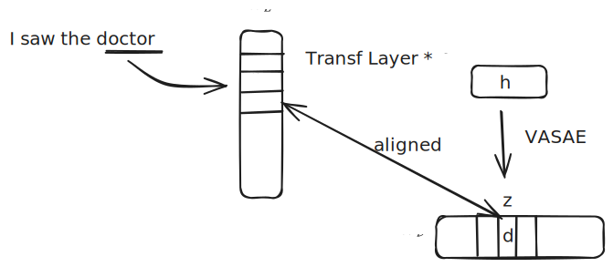

**Input-token semantic similarity**
记第 $\ell$ 层所有 aligned feature 的对应的 token embedding 为 $\E^{(\ell)}\in\R^{\da\times d}$. 记输入位置 $p$ 的 token 的 embedding 组成的矩阵为 $\H_p^{(0)} \in \R^{B\times d}$.

定义输入语义相似度矩阵
$$\U_p^{(\ell)} = \cos\left(\H_p^{(0)},\, \E^{(\ell)}\right) \in \R^{B\times \da},$$
这里的 $\cos(\cdot,\cdot)$ 表示对两矩阵行向量两两计算 cosine similarity，得到 pairwise similarity matrix。

**Correlation with feature activation**
由于这 $\da$ 个特征都是 aligned features，它们对应的激活维度发生缩减。这是从原始 $\Z^{(\ell)}\in\R^{B\times S\times \ds}$ 中，在位置 $p$ 选取并仅保留 aligned feature 维后得到的子矩阵。记对位置 $p$ 处的输入，第 $\ell$ 层 VASAE 的这 $\da$ 个对齐特征在此处的激活张量为 $\Z_p^{(\ell)} \in \R^{B\times \da}.$

然后沿着样本维（batch size dimension，$B$）计算 Pearson correlation，即可计算得到输入语义相关系数向量：
$$\rho_{\text{in},p}^{(\ell)} = \operatorname{corr}_{b}\left(\Z_p^{(\ell)},\, \U_p^{(\ell)}\right) \in \R^{\da}.$$ 

## 输出相关性检测
本节检验几何对齐得到的 feature 是否也对应模型输出分布中的语义信息。核心问题是：对于一个已经对齐到 token $\t_f^{(\ell)}$ 的 feature，它在位置 p 上的激活，是否会随着该位置模型输出分布对 $\t_f^{(\ell)}$ 的语义偏向而变化。举个例子，若某个 feature 对齐到 “doctor”，那么当模型在位置 p 更倾向输出 “doctor”, “nurse”, “hospital” 等语义接近的 token 时，该 feature 的激活也应更高。

**Output-token semantic similarity**
记位置 $p$ 处模型输出的 next-token 概率分布为 $P_p \in \R^{B\times \dv}$, 其中 $P_{p,b,v}$ 表示第 $b$ 个样本在位置 $p$ 处对词表 token $v$ 的输出概率。

为降低计算量，我们仅保留每个样本输出分布中概率最高的 top-M 个 token。记对应的 token id 为 $V_p \in \{1,\dots,\dv\}^{B\times M}$, 在 top-M 上重新归一化后的概率为 $\tilde P_p \in \R^{B\times M}$.

对第 $b$ 个样本，记其 top-M 输出 token 的 embedding 为 $\WE[V_{p,b,:}] \in \R^{M\times d}$.

于是可构造该样本在位置 $p$ 处的输出语义向量 
$$\bar{\H}_{p,b}^{(0)}=\sum_{m=1}^{M} \tilde P_{p,b,m}\,\WE[V_{p,b,m}]\in\R^d.$$

将所有样本堆叠后，得到输出语义向量矩阵 $\bar{\H}_p^{(0)}\in\R^{B\times d}$.

定义输出语义相似度矩阵为
$$\U_{\mathrm{out},p}^{(\ell)}=\cos\!\left(\bar{\H}_p^{(0)},\, \E^{(\ell)}\right)\in \R^{B\times \da}.$$

其中 $\U_{\mathrm{out},p}^{(\ell)}[b,f]$ 表示第 $b$ 个样本在位置 $p$ 处的输出分布，与第 $f$ 个 aligned feature 对齐 token 的语义接近程度。


**Correlation with feature activation**
与输入相关性检测相同，记位置 $p$ 处第 $\ell$ 层 aligned features 的激活矩阵为 $\Z_p^{(\ell)} \in \R^{B\times \da}$.


然后沿样本维 $B$ 计算 Pearson correlation，得到输出语义相关系数向量：

$$\rho_{\text{out},p}^{(\ell)}=\operatorname{corr}_{b}\!\left(\Z_p^{(\ell)},\,\U_{\mathrm{out},p}^{(\ell)}\right)\in \R^{\da}.$$


其中第 $f$ 维 $\rho_{\text{out},p,f}^{(\ell)}$ 表示：对第 $\ell$ 层位置 $p$ 处对齐 feature $f$，其激活值是否会随着模型输出分布对其对齐 token 的语义偏向而稳定变化。

若 $\rho_{\text{out},p,f}^{(\ell)}$ 较高，则说明该 feature 不仅在几何上对齐到某个 token embedding 方向，而且其激活还与模型输出分布中的相应语义信息显著相关。

# 实验步骤

分析 F001 VASAE-Soft checkpoint（GPT-2 L0–L11, dim_sparse=50257, k=32；Llama-3.1-8B L0–L31, dim_sparse=128256, k=32），不训练新模型。Checkpoint 位于 `/scratch/b5bq/pu22650.b5bq/VASAE_out/001_F_Benchmarking/001F_{model}_L{layer}_soft/`。

**逐层分析几何对齐、输入输出相关性检测**。每层一个 Slurm 任务（job array），单卡运行 `scripts/analyze/alignment/analyze_alignment_quality.py`，依次完成几何对齐、基于 Pearson correlation 的输入相关性检测（n_samples=5000, max_length=256）以及输出相关性检测（top_m=50），输出逐层 JSON 结果。GPT-2 12 层、Llama 32 层分别提交。

```bash
sbatch exp/F002_AlignmentAnalysis/run_gpt2.sh
sbatch exp/F002_AlignmentAnalysis/run_llama.sh

sbatch exp/F002_AlignmentAnalysis/run_llama_5e-3_save.sh # Llama λ=5e-3 几何对齐验证。F001A 消融实验中 Llama λ=5e-3 的代表层 checkpoint（L0/L15/L31），使用 `scripts/analyze/alignment/compute_geometric_alignment.py` 计算几何对齐，验证提高 anchor 系数是否改善 Llama 的对齐效果。
```

**绘图：对齐分布**。全部层完成后，运行 `scripts/plot/plot_alignment_quality.py` 读取逐层 JSON 及 `max_sims.pt`，生成以下图表（注：图中显示的 $s(i)$ 为旧版符号，即对应本文方法中定义的对齐分数 $\a_f$）：
- 总体 $\a_f$ 密度分布图（VASAE-Soft vs Plain SAE，聚合所有层）
- 分层 $\a_f$ 箱型图

```bash
# GPT-2
uv run python scripts/plot/plot_alignment_quality.py \
    --input-dir exp/F002_AlignmentAnalysis/gpt2 \
    --model-label GPT-2 \
    --output-dir exp/F002_AlignmentAnalysis/figures/gpt2

# Llama λ=1e-4
uv run python scripts/plot/plot_alignment_quality.py \
    --input-dir exp/F002_AlignmentAnalysis/llama \
    --model-label "Llama-3.1-8B" \
    --output-dir exp/F002_AlignmentAnalysis/figures/llama

# Llama λ=5e-3（使用原始 llama 数据提供 plain baseline）
uv run python scripts/plot/plot_alignment_quality.py \
    --input-dir exp/F002_AlignmentAnalysis/llama_5e-3 \
    --baseline-dir exp/F002_AlignmentAnalysis/llama \
    --model-label "Llama-3.1-8B (λ=5e-3)" \
    --output-dir exp/F002_AlignmentAnalysis/figures/llama_5e-3
```

**Case study 可视化**。若干输入文本逐层用 VASAE encoder 取 top-1 对齐 feature，画热图（行=层，列=序列位置，单元文字=对齐 token，颜色=激活程度的softmax 概率）。

```bash
# GPT-2（F002 主 checkpoint，L0–L11 全部）
uv run python scripts/plot/casestudy_vasae.py \
    --model gpt2 \
    --sae-root /scratch/b5bq/pu22650.b5bq/VASAE_out/001_F_Benchmarking \
    --sae-pattern '001F_gpt2_L{layer}_soft' \
    --layers 0-11 \
    --output-dir exp/F002_AlignmentAnalysis/casestudy/gpt2 \
    --device cuda

# Llama-3.1-8B λ=5e-3（只有 L0/L15/L31 保存了 checkpoint）
uv run python scripts/plot/casestudy_vasae.py \
    --model meta-llama/Llama-3.1-8B \
    --sae-root /scratch/b5bq/pu22650.b5bq/VASAE_out/001A_F_AblationSoft \
    --sae-pattern '001AF_llama_lambda_L{layer}_a5e-3' \
    --layers 0,15,31 \
    --output-dir exp/F002_AlignmentAnalysis/casestudy/llama_5e-3 \
    --device cuda
```


输出保存在 `exp/F002_AlignmentAnalysis/casestudy/{model}/`，每个 case 一个 PDF + PNG，外加一份 `manifest.json` 记录每格的 token 与概率。

> 为避免 "the"、标点等高频 feature 在每个位置上都最大、压垮可视化，默认 `--mode relative`：每个 feature 先减去本句内各位置上的均值，再 argmax，从而显示"相对此句平均更活跃"的 feature。否则，需要直接选择最大激活使用`--mode softmax`。

> 默认测试用例列表在 `scripts/plot/casestudy_vasae.py:DEFAULT_CASES` 中定义。如需自定义，传 `--cases-file path/to/cases.json`，格式为 `[{"slug": ..., "text": ...}, ...]`。

# 结果讨论


## 几何对齐

### GPT-2

Figure 1 展示了浅（L0）、中（L6）、深（L11）三个代表层的 $\a_f$ 分布。VASAE-Soft（蓝色）呈极端双峰：~93% 的 feature 聚集在 $\a_f \approx 1.0$，其余散落在低值区；而 plain SAE（灰色）的 $\a_f$ 集中在 0.1–0.2，无任何 feature 超过 0.8 阈值。这确认了高对齐率完全由 anchor loss 驱动（数据来源：`exp/F002_AlignmentAnalysis/gpt2/L{0,6,11}/results.json`；若按层查询使用 `exp/F002_AlignmentAnalysis/gpt2/L{layer}/results.json`，其中 plain SAE 对应 `geometric_baseline.*` 字段）。

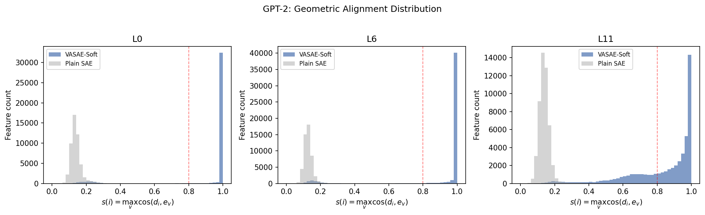

L0–L10 的对齐率稳定在 89–94%，L11 下降至 68.5%——最终层的 residual stream 经过所有 layer 变换后，decoder 方向更难精确对齐到 input embedding 空间。覆盖率（对齐 feature 覆盖的 unique token 占词表比例）稳定在 53–56%，低于对齐率是因为多个 feature 可对齐同一高频 token（数据来源：`exp/F002_AlignmentAnalysis/gpt2/L{layer}/results.json`，对应 `geometric.aligned_pct` 与 `geometric.coverage_pct` 字段）。


### Llama-3.1-8B

Llama 的 001_F checkpoint 使用了相同的 anchor loss 配置（anchor_mode=hard, anchor_coeff=0.0001），但**全部 32 层的对齐率均为 0.0%**——几乎没有 feature 达到 $\a_f \geq 0.8$ 的阈值（L0 仅 2 个，其余层为 0）。作为对照，plain SAE 同样为 0.0%（数据来源：`exp/F002_AlignmentAnalysis/llama/L{layer}/results.json`，对应 `n_aligned`、`geometric.aligned_pct`、`geometric_baseline.aligned_pct` 字段）。

这一结果表明当前的 anchor loss 强度（coeff=0.0001）对 Llama-3.1-8B 不足以驱动 decoder 方向对齐到 token embedding。可能的原因包括：(1) Llama 的 embedding 空间（dim=4096）与 hidden state 空间的关系比 GPT-2（dim=768）更复杂；(2) anchor 系数相对于 Llama 的 MSE loss 量级过小。后续实验可尝试增大 anchor_coeff 或采用不同的 anchor mode 进行验证。

由于几何对齐未发生，Llama 的功能分类分析无法有意义地进行，本实验对 Llama 仅报告几何对齐的负面结果。

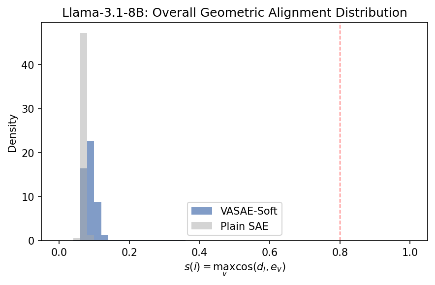

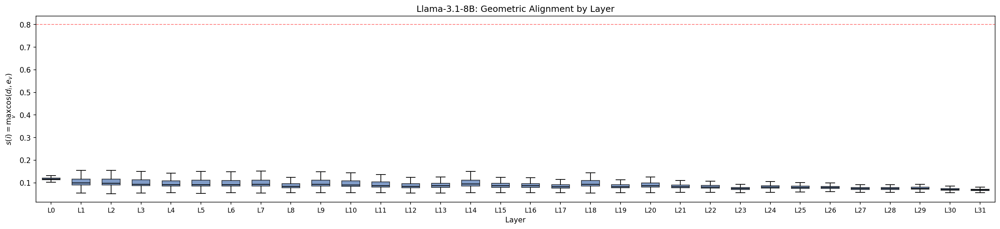


gpt2-small 尺寸小，$\lambda =1e-4$ 足以推动对齐产生。llama 是否需要更大的比例，当我们使用了 $\lambda =5e-3$，我们测试了 $L=0，15,31$ （见 F001A_AblationSoft），注意我们为了快速测试只挑了浅中深三层做代表（数据来源：`exp/F002_AlignmentAnalysis/llama_5e-3/L{0,15,31}/results.json`）。

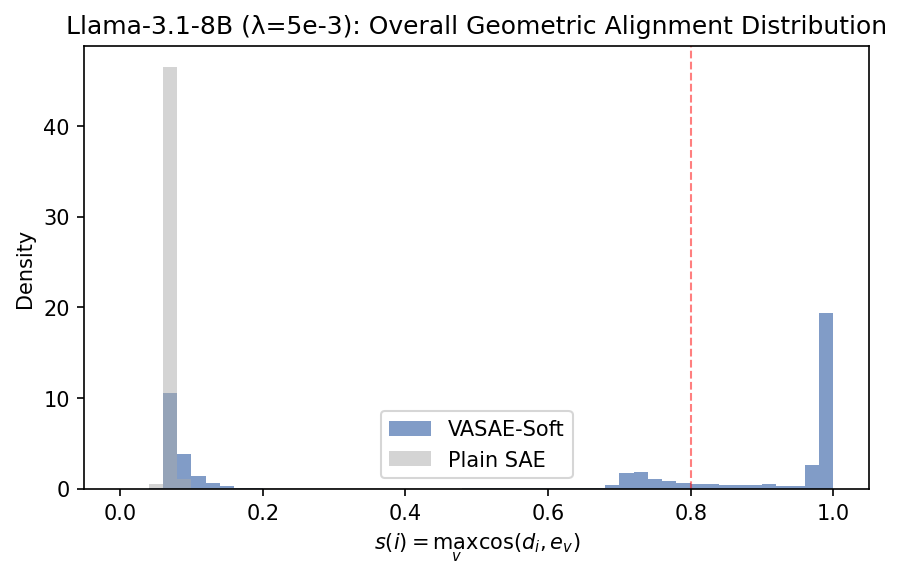

在这个量级下，一些对齐开始产生了，我们接着看单个层的分布

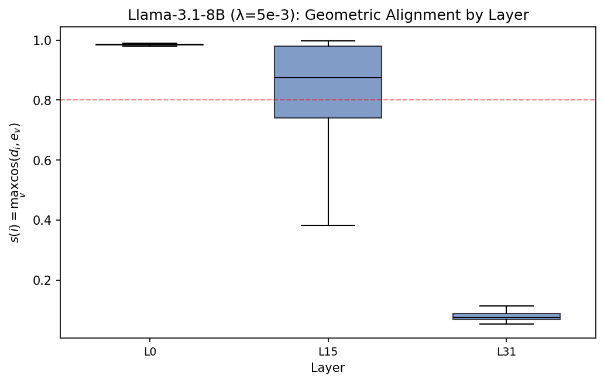

看一看到浅层对齐的最好，而最后一层完全没有对齐，我们猜测这是因为 llama 的 WU 没有和 WE 对齐，这和 gpt2 不同（数据来源：`exp/F002_AlignmentAnalysis/llama_5e-3/L{0,15,31}/results.json`，对应 `geometric.aligned_pct` 字段）。

## Case study 可视化分析

下面按 case 逐项展示热图并做定性分析。热图中每个单元表示该层该位置 top-1 对齐 feature 对应 token，颜色表示该位置相对激活强度（归一化后）。

### GPT-2（L0–L11）

#### names_townsend

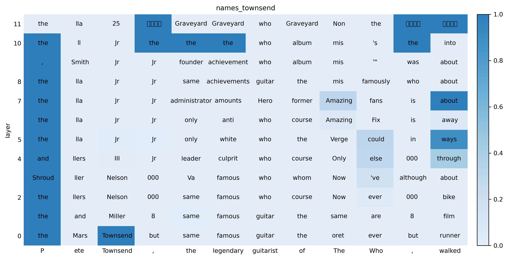

浅层到中层（L0–L7）在人名与音乐语义附近会反复出现 `Townsend`、`guitar`、`who` 等局部相关 token，但到 L11 明显退化为 `Graveyard`/`サーティ` 等高频噪声 token。说明 GPT-2 的 aligned feature 在中低层仍保留一些主题相关性，但深层稳定性不足。

#### names_fey

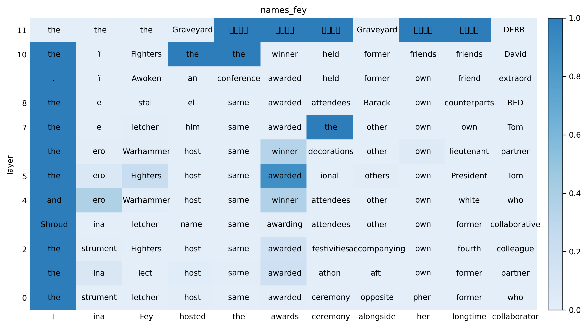

中层出现 `host`、`awarded`、`ceremony`、`partner` 等与句子语义接近的词，显示 feature 对“颁奖场景”有一定聚焦；但最深层同样被重复噪声 token 主导，语义可解释性下降。

#### names_nicole

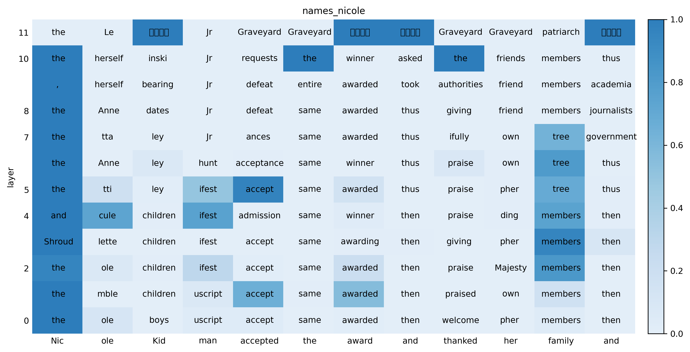

L0–L6 可见 `accept`、`awarded`、`thanks`、`family` 等事件链相关 token，说明对“获奖-致谢”模板有局部编码；L11 退化趋势与其它 case 一致，深层解释性较弱。

#### morph_ible

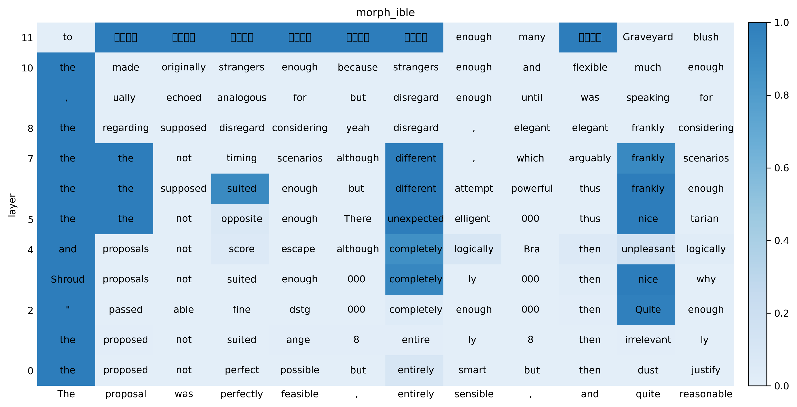

该句在浅中层能看到 `perfect`、`possible`、`entirely`、`different` 等形容词/副词相关模式，体现出一定形态学与句法角色敏感性；但深层出现大量无关重复 token，表明这种敏感性主要存在于较浅层。

#### place_street

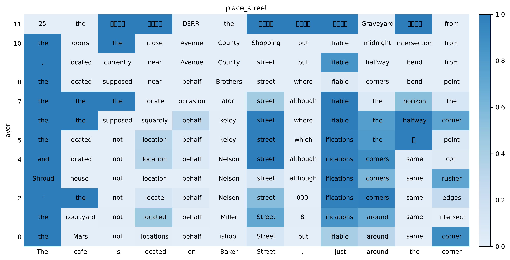

`street` 在 L4–L8 多层重复激活，且与 `located`、`around`、`corner` 等位置描述词共现，说明该 case 的位置语义锚定最明显；不过 L11 仍出现噪声化，说明高层难以保持稳定 token-level 对齐。

#### self_intro

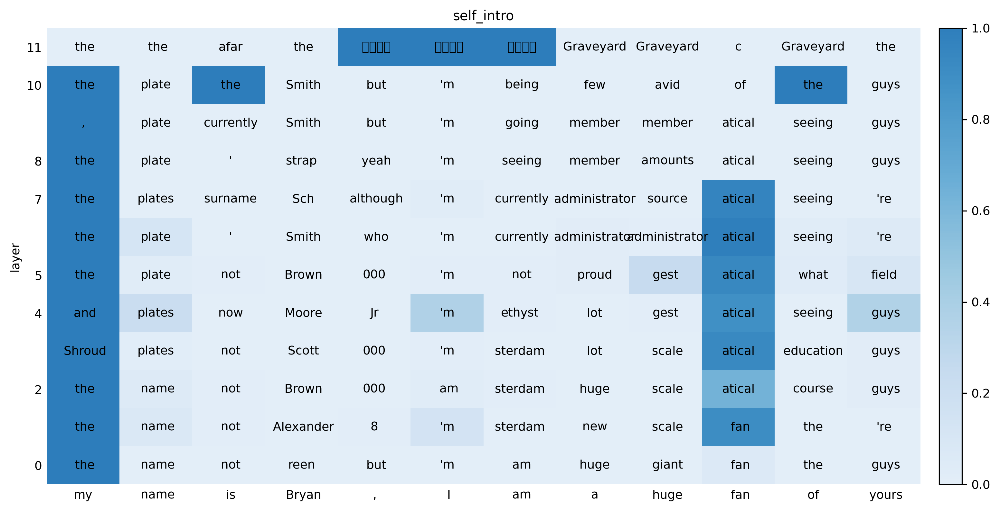

浅层可见 `name`、`am`、`fan` 等自我介绍模板词，中层开始混入 `administrator`、`atical` 等偏离语义 token，深层进一步退化。这与“句式模板能被浅层捕捉，但跨层保持困难”的现象一致。

#### ioi_simple

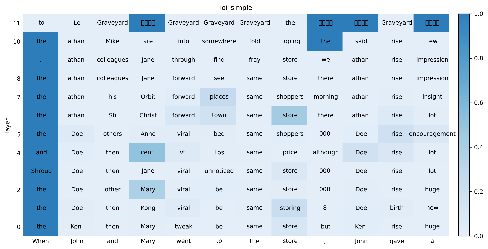

L0–L7 对 `John`、`Mary`、`store` 仍有可见追踪，但并未稳定呈现 IOI 所需的角色绑定（例如给谁）特征；L11 同样噪声化。说明当前 top-1 aligned feature 可反映实体/地点线索，但不足以可靠编码关系推理。

小结：GPT-2 case study 与前文相关性分析一致，表现为“浅中层局部可解释、深层显著退化”。

### Llama-3.1-8B（$\lambda=5e-3$, L0/L15/L31）

#### names_townsend

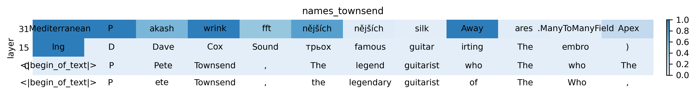

L0 基本保留 `Pete/Townsend/guitarist/The Who` 的主题信息；L15 语义已明显漂移；L31 出现多语种碎片与代码样式 token，显示深层对齐失稳。

#### names_fey

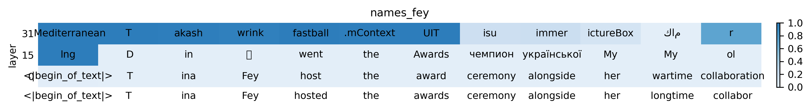

L0 能复现 `Fey/award/ceremony` 等关键信号；L15 仅保留少量上下文相关 token；L31 基本由无关 token 主导，说明对齐主要集中在浅层。

#### names_nicole

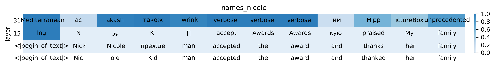

L0 对姓名与“accepted the award”事件链有较清晰响应；L15 局部可见 `accept/Awards/family`；L31 大幅退化，和几何对齐统计里 L31 无对齐相吻合。

#### morph_ible

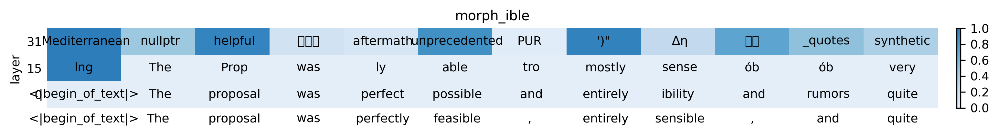

L0 仍有 `proposal/possible/entirely` 的语义痕迹；L15 表示开始变散；L31 转为无关高频 token。说明该设置下 Llama 对抽象语义模板的稳定层深较浅。

#### place_street

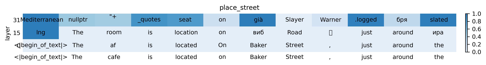

L0 能稳定命中 `Baker/Street` 与位置短语；L15 只保留部分地理词；L31 基本丢失空间语义，进一步支持“对齐仅在浅层可用”的结论。

#### self_intro

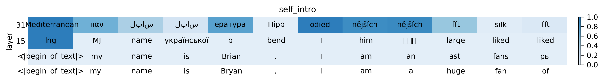

L0 对 `my/name/I/am` 自我介绍结构有明显响应；L15 局部保留；L31 几乎完全噪声化。与 Llama 的层级对齐分布（L0 强、L31 弱）一致。

#### ioi_simple

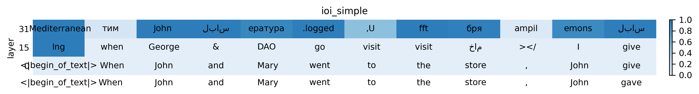

L0 对 `John/Mary/store` 的实体线索仍有响应；L15 已出现明显漂移；L31 以无关 token 为主。该 case 同样未显示稳定的关系推理 feature。

小结：Llama 在 $\lambda=5e-3$ 下，case study 呈现“L0 明显可解释，L15 部分可解释，L31 基本失稳”，与前文几何对齐统计（L0 有对齐、L31 无对齐）和相关性结果一致。

## Correlation-based 输入/输出相关性分析
### GPT-2 结果

| Layer | Alive+Aligned | $\rho_{\text{in}}$ mean | $\rho_{\text{out}}$ mean | input_related | output_related |
|-------|--------------|------------------------|-------------------------|---------------|----------------|
| L0    | 6216         | ~0                     | -0.0006                 | 0             | 0              |
| L6    | 3911         | ~0                     | -0.0003                 | 0             | 0              |
| L11   | 193          | ~0                     | -0.0023                 | 0             | 0              |

GPT-2 所有 12 层的 $\rho_{\text{in}}$ 和 $\rho_{\text{out}}$ 均接近 0，几乎没有 feature 达到 $|\rho| \geq 0.1$ 的阈值（数据来源：`exp/F002_AlignmentAnalysis/gpt2/L{layer}/results.json`；上表三行对应 `L{0,6,11}` 的 `n_alive_aligned`、`input_correlation.mean_rho`、`output_correlation.mean_rho`、`categories.*` 字段）。

**Case study：条件相关性分析（$z > 0$ only）。** 我们进一步只在 feature 实际激活的位置上计算 correlation，以排除大量 $z=0$ 位置的稀释效应。在 5000 samples（GPT-2 L0）中共观测到 107,573 次 aligned feature 激活，涉及 6216 个 unique feature。对其中 $\geq 5$ 次激活的 2518 个 feature 计算条件 Pearson correlation（其中 6216 可在 `exp/F002_AlignmentAnalysis/gpt2/L0/results.json` 的 `n_alive_aligned` 查询；其余条件相关性统计当前未落在 F002 目录的独立 JSON 中）：

| 统计量 | 值 |
|--------|-----|
| corr mean | 0.2215 |
| corr median | 0.2810 |
| corr > 0.5 | 697 (27.7%) |
| corr > 0.3 | 1198 (47.6%) |
| corr > 0.1 | 1644 (65.3%) |

表面上看条件 corr 不低，但进一步分析发现这是假信号：

1. **cos similarity 动态范围极窄**。GPT-2 embedding space 中，任意 token pair 的 cosine similarity 集中在 0.15–0.30（mean=0.217, std=0.034）。不管输入 token 是什么，与 aligned token 的 cos 值变化仅 ±0.03。
2. **高 corr 源于噪声**。当 cos 值的方差仅 ~0.001 时，数据点又少（n~5–15），微小的随机波动就能产生 $|\rho| > 0.9$。例如 feat 32404 aligned to `' grapp'`，输入分别是 `' However'`（cos=0.296）和 `' Daniel'`（cos=0.325），corr=+0.996——但 cos 值仅差 0.03，这个 correlation 无实际意义（该段示例与条件相关性统计当前未落在 F002 目录的独立 JSON 中）。

### 窗口上下文实验

考虑到 layer $\ell$ 的 feature 通过 attention 已经看到上下文，我们测试用窗口内 token 的 max cosine similarity 替代单个 token：

$$u_{\text{win},p,f} = \max_{q \in [p-w,\, p]} \cos\!\left(\WE[x_q],\, \mathbf{e}_f\right), \quad w=32.$$

| 方法 | cos range (mean ± std) | corr > 0.1 |
|------|----------------------|------------|
| single token | 0.217 ± 0.034 | 65.3% |
| window max ($w$=32) | 0.316 ± 0.041 | 35.8% |

Window max 将 cos 均值从 0.22 提升到 0.32，但 correlation 反而下降（mean 0.23→0.01）。原因是：32 个 token 的窗口中几乎总能找到一个与 aligned token cos~0.3 的 token，导致 window max 对所有位置都给出相近的高值，区分度更差（该窗口实验统计当前未落在 F002 目录的独立 JSON 中）。

**结论：GPT-2 的 token embedding space 不适合用 cosine similarity 做输入相关性检测。** Token 间 cos 值过于集中，无论使用单 token 还是上下文窗口，都缺乏足够的语义区分度来产生有意义的 correlation。

### Llama-3.1-8B（$\lambda$=5e-3）结果

| Layer | Alive+Aligned | $\rho_{\text{in}}$ mean | $\rho_{\text{out}}$ mean | input_related | output_related |
|-------|--------------|------------------------|-------------------------|---------------|----------------|
| L0    | 10921        | 0.0092                 | 0.0000                  | 330           | 1              |
| L15   | 1563         | ~0                     | -0.0002                 | 0             | 0              |
| L31   | 0            | —                      | —                       | 无对齐         | —              |

Llama L0 出现了有意义的 input_related features（330/10921），其中 top features 展现出强输入相关性（数据来源：`exp/F002_AlignmentAnalysis/llama_5e-3/L{layer}/results.json`；上表对应 `L{0,15,31}`，下表来自 `L0/results.json` 的 `examples` 字段）：

| Feature | Aligned Token | $\rho_{\text{in}}$ | $\rho_{\text{out}}$ |
|---------|--------------|-------------------|-------------------|
| 96339   | ' Townsend'  | **+0.7808**       | -0.0032           |
| 37780   | ' Fey'       | **+0.7600**       | -0.0059           |
| 11725   | ' Nicole'    | **+0.7495**       | +0.0024           |
| 9122    | 'mathrm'     | +0.0254           | **+0.1911**       |

Llama L0 的 top input_related features 均为专有名词，$\rho_{\text{in}} > 0.75$，表明这些 feature 确实在输入 token 语义接近 aligned token 时更强地激活。这与 GPT-2 形成鲜明对比。

L15 和 L31 的相关性接近 0，与 L31 完全没有几何对齐的结果一致。

### 分析与讨论

GPT-2 与 Llama 的差异可能源于 embedding space 的结构性不同：

- **GPT-2**（dim=768）：token embedding 的 cosine similarity 集中在窄区间（0.1–0.3），语义区分度低。这导致无论用何种基于 cos similarity 的方法，都难以检测输入相关性。
- **Llama**（dim=4096）：更高维的 embedding space 可能提供了更好的语义分离，使得 cos similarity 有更大的动态范围，从而使 correlation 方法能够捕捉到有意义的信号。
